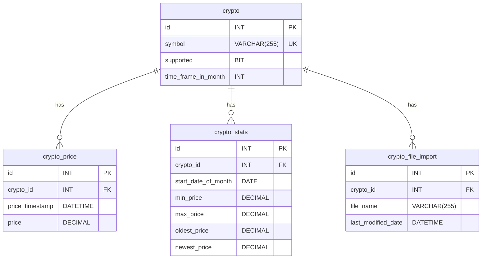

# Crypto Recommendation Service

### Table of Contents
- [Introduction](#introduction)
- [About the Application](#about-the-application)
- [Tech Stack](#tech-stack)
- [Architecture](#architecture)
- [Database and ER Diagram](#database-and-er-diagram)
- [Steps to Build and Run the Application](#steps-to-build-and-run-the-application)
- [Accessing the Swagger UI](#accessing-the-swagger-ui)

## Introduction

This service is designed to provide valuable statistics and recommendations based on historical cryptocurrency data. It leverages the powerful data processing capabilities of Spring Batch to handle large volumes of cryptocurrency price data, and exposes a set of RESTful APIs for clients to retrieve statistical and recommendation information.

## About the Application

This application is primarily composed of two components:

1. The CSV Importer (Spring Batch job) that reads CSV files containing cryptocurrency price data, calculates monthly statistics (oldest, newest, min, max price), and stores these results in the database.

2. The REST API service that exposes endpoints to retrieve the calculated statistical data and provides recommendations based on the normalized range of crypto prices.

## Tech Stack

- Java 17: The application is developed using Java 17, the latest version of the Java programming language.

- Spring Boot 2.7.14: Spring Boot is used to create a production-ready application with minimal configuration.

- Spring REST API (Spring Web): Spring Web is used to create RESTful APIs to expose the calculated statistical data and recommendations.

- Lombok 1.18.16: Lombok is used to reduce boilerplate code by automatically generating getters, setters, constructors, and other utility methods.

- Spring Data JPA & MySQL-8: Spring Data JPA is used to simplify the interaction with the MySQL-8 database and handle database operations.

- Spring Batch: Spring Batch is used for efficiently processing large volumes of data, specifically for reading cryptocurrency price data from CSV files and performing calculations.

## Architecture

### CSV Importer

The CSV Importer in this application uses Spring Batch to efficiently read cryptocurrency price data from CSV files, perform computations, and update the database. It is structured in the following way:

- Read CSV files containing historical price data for various cryptocurrencies
- Imports data into the `crypto_price` table
- Reads data from the `crypto_price` table and uses aggregate functions to calculate the oldest, newest, min, and max price for each month.
- Writes these calculated statistics to the `crypto_stats` table
- Tracks information about the import process in the `crypto_file_import` table which contains metadata about the CSV file imports, such as the file name and last modified date. This helps in keeping track of what files have been imported and when.

### Rest API

The REST API service exposes three endpoints:

1. **/api/v1/cryptos/{symbol}/stats**: This endpoint returns the oldest, newest, min, max price for the given crypto symbol.
2. **/api/v1/cryptos/recommendations/highest-normalized-range**: This endpoint returns the cryptocurrency with the highest normalized range for a specific day.
3. **/api/v1/cryptos/recommendations/sorted-by-normalized-range**: This endpoint returns a descending sorted list of all cryptocurrencies, comparing the normalized range (i.e. (max-min)/min).

## Database and ER Diagram

This application uses the following tables in the database:

1. **crypto**: Contains information about each unique cryptocurrency.
2. **crypto_price**: Contains the historical price data of different cryptocurrencies.
3. **crypto_stats**: Contains the calculated oldest, newest, min, and max prices for each month for every cryptocurrency.
4. **crypto_file_import**: Contains the information about CSV file imports.



## Steps to Build and Run the Application

1. **Clone the repository:**:
   ```
   git clone https://github.com/vanathin/crypto-recommendation.git
   ```
   
2. **Navigate to the project directory:**:
   ```
   cd crypto-recommendation
   ```
   
3. **Build the application**:
   Navigate to the root directory of the application and run the following command:
    ```
    mvn clean install
    ```
   This will build the application and generate a .jar file in the target directory.

4. **Build the Docker image**:
   Now, you can build a Docker image using the Dockerfile (Apple Silicon(ARM) platform) provided. Run the following command in the terminal:
    ```
    docker build -t crypto-recommendation .
    ```
   This will create a Docker image named crypto-recommendation.

5. **Run Docker Compose**:
   After the Docker image has been created, you can start the application using Docker Compose. Run the following command in the terminal:
    ```
    docker-compose up --build
    ```
   This will start the MySQL database and the Crypto Recommendation application.

## Accessing the Swagger UI

After you have the application running, you can access the Swagger UI by opening a browser and navigating to [Click here to access swagger ui](http://localhost:8080/swagger-ui/index.html#/).

## Future Improvements

The current version of the application has room for improvements. These improvements have been identified but have not been implemented due to time constraints:

1. **Distributed Locking Mechanism:** Currently, our Spring Batch process that imports files into the database can only run in a single container instance. If multiple instances attempt to execute the batch process, data inconsistencies and conflicts can arise. To resolve this issue, a distributed locking mechanism can be utilized, for instance, using the [ShedLock](https://github.com/lukas-krecan/ShedLock) library.